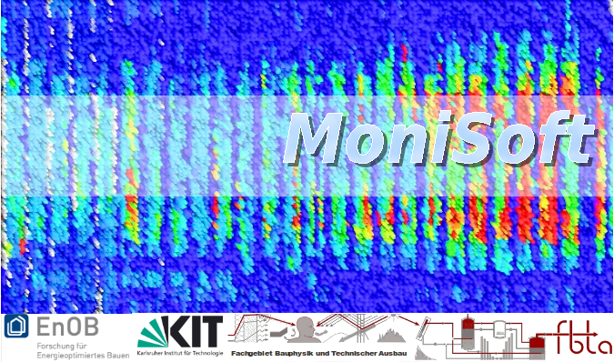

# MoniSoft



MoniSoft ist eine plattformunabhängige Software, die das Technische Monitoring und die Betriebsanalyse von Gebäuden vereinfacht. Durch eine datenbankbasierte Messwertverarbeitung mit Qualitätssicherungsfunktionen und vielfältigen Visualisierungsmöglichkeiten wird die Betriebsoptimierung von Gebäuden ermöglicht. Neben den eigentlichen Messdaten sind auch Informationen über das Gebäude, Flächen, Messpunkteigenschaften, Messdatenqualität und -plausibilität sowie Nutzereinstellungen enthalten. Somit kann die Software von Experten für detaillierte Auswertungen und von weniger erfahrenen Personen für eine schnelle Schwachstellenerkennung genutzt werden. Die einheitliche Datenstruktur ermöglicht Auswertungen über verschiedene Anlagen-,Gebäude und Quartiersbereiche hinaus. Einfache Strukturierung einer Vielzahl an Datenpunkten und eine graphische Oberfläche erleichtern das Arbeiten. Automatische Auswertungen und Erzeugung von Web-Grafiken und Mail-Nachrichten sind ebenfalls möglich.

## Entwicklung und Publikation von MoniSoft

### Karlsruher Institut für Technologie (KIT)

In dem Zeitraum von 2007 bis 2015 ist am Fachgebiet Bauphysik und Technischer Ausbau (fbta) am Karlsruher Institut für Technologie (KIT) ein Softwarepaket zum Technischen Monitoring entstanden. Die deutschlandweite in über 20 Institutionen eingesetzte Software wurde im Rahmen von Forschungsprojekten, gefördert durch das Bundesministerium für Wirtschaft und Energie (BMWI) sowie das Bundesamt für Bauwesen und Raumordnung (BBR) entwickelt. 

### Technische Hochschule Rosenheim (THRo)

Ab dem Jahr 2014 erfolgte die Weiterentwicklung von MoniSoft an der Technischen Hochschule Rosenheim im Rahmen von Forschungsprojekten, gefördert durch das BMWI, EnEff:Stadt, BMWI Begleitforschung, EnEFF:Schule und dem Bundesinstitut für Bau,- Stadt- und Raumforschung im Bundesamt für Bauwesen und Raumordnung. Ein überarbeitetes Handbuch sowie Videotutorials leisten erstmals angemessenen Nutzer-Support. Parallel dazu wurde an der Hochschule Rosenheim damit begonnen, Erweiterungen zu programmieren sowie kleinere Fehler zu beheben. In der Zwischenzeit ist MoniSoft in die Jahre gekommen, wodurch eine Weiterentwicklung der Software nicht mehr sinngemäß ist. Somit wird MoniSoft hiermit als OpenSource veröffentlicht. Dies erfolgt im Rahmen eines Forschungsprojektes gefördert durch das Bundesministerium für Wirtschaft und Klimaschutz (BMWK).

### Begleitforschung: Institut für ZukunftsEnergie- und Stoffstromsysteme (IZES)
Ab dem Jahr 2022 übernimmt das Institut für ZukunftsEnergie- und Stoffstromsysteme im Rahmen der  [wissenschaftlichen Begleitforschung Energiewendebauen](https://www.energiewendebauen.de/forschung/begleitforschung-energiewendebauen) die weitere Koordination von Monisoft.  Dies umfasst die Beantwortung von Fragen zur Nutzung und zur Weiterentwicklung von MoniSoft sowie die Vernetzung der User und Developer Community.  

Der technische Support von Monisoft wird dagegen ab sofort eingestellt.

Nehmen Sie gerne unter [monisoft@izes.de](mailto:monisoft@izes.de) Kontakt zur Begleitforschung auf, wenn Sie an einer Weiterentwicklung von MoniSoft interessiert sind und sich mit der Community austauschen möchten.

## Voraussetzungen

JDK: = 8  
Maven: >= 3  
MySQL 5.5  

## Installation

Klonen des Repositories

```
git clone https://github.com/monitoringsoftware/monisoft
```

MoniSoft erstellen

```
mvn 
```
Alternativ ist eine compilierte Version im Ordner [MoniSoftBase](https://github.com/monitoringsoftware/monisoft/tree/main/MoniSoftBase) enthalten.

MoniSoft starten

```
java -jar jmonitoring.jar
```


Die Datenbank-Software selbst (MySQL) ist nicht Bestandteil von MoniSoft und muss zuvor getrennt installiert werden. 

## Dokumentation

Detaillierte Informationen befinden sich im [MoniSoft-Handbuch](copy_to_dist/MoniSoft-Handbuch.pdf)

## MoniSoft-Screencast

[MoniSoft-Screencast](https://www.youtube.com/watch?v=cZKX0Ee6OT8&list=PLT8o9t6885fcF5veJgQtQx6PQlvpiV0YX&index=1)

## Lizenz

Die Lizenzbedingungen als Text-Datei [LICENSE](LICENSE) 
oder im Word-Format [LICENSE.docx](LICENSE.docx) 

